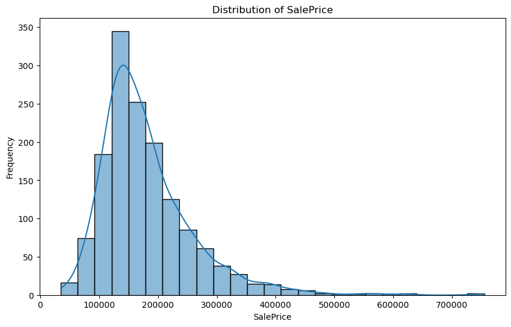
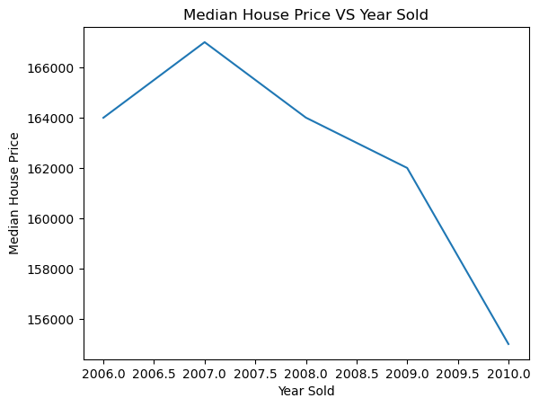
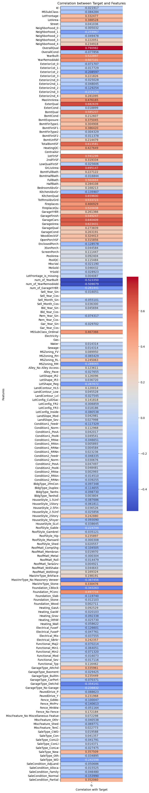
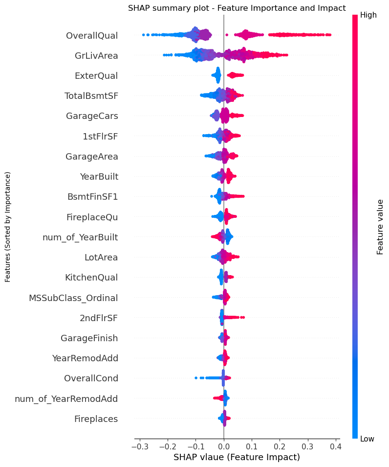

# Real Estate Price Prediction
This repository contains a project aimed at predicting the price of a house from given key features such as Lot Area, Number of bedrooms and bathrooms, Year built, Year renovate, Garage size, etc.

## Table of contents
+ Project Overview
+ Installation
+ Files
+ Acknowledgement

### Project Overview
As a home buyer a dream house is more than just basement height, proximity to bustops and number of bathrooms. This project looks into predicting the price of a house taking lots of features into consideration. It was done for submission in the Kaggle House Price Prediction Competition. The evaluation metric the competition body required was Root Mean Squared Logarithmic Error (RMSLE).
The steps taking in creating the model:

- **Exploratory Data Analysis**: Which involves going through the data, it's columns and it's rows checking for missing data, correlation, relationships and patterns.

  **Sale Price Column Distribution**
  



**Year Sold Vs Median House Price**



- **Filling Missing Data**: This is a crucial part of the model creation section, Models cannot thoroughly learn from `Nan`∆ values. The method of filling is crucial.
- **Converting categorical data into Numerical form and encoding them**: As the intro says,this section involves converting all categorical and all object dtypes into Numerical dtypes. This is crucial as Machine learning Models only learn from Numerical data.
- **Modelling**: This section involving applying machine learning models to our already clean datase. In this project Xgboost Regressor and Ensemble's Random Forest Regressor were both evaluated and tuned to find which found more pattern and learned better on the data. Xgboost learned better and produced a better RMSLE score of `1.05770`.

**Correlation Matrix between Target column and the other columns**



**Feature Importance of Columns on Ensemble Model**



### Installation
1. **Anaconda**
	```bash
	 https://www.anaconda.com/download
	```

### Files
1. **Clone The Repository**
	```bash
	git clone https://github.com/Darc-lord/Real-Estate-Price-Prediction.git
	cd Real-Estate-Price-Prediction
	```

2. **Download Dataset**
	```bash
	 https://www.kaggle.com/competitions/home-data-for-ml-course/overview
	```	

## Acknoledgements
+ Kaggle
+ Scikit-learn
+ Python
